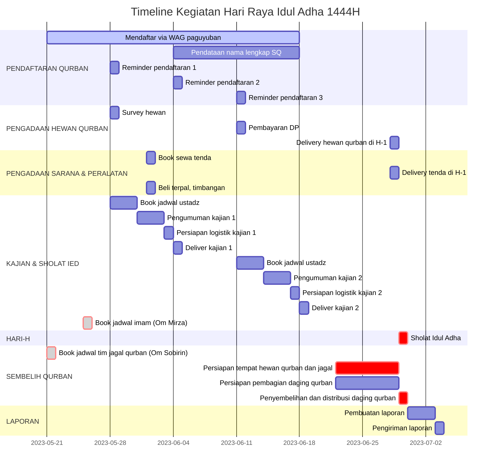
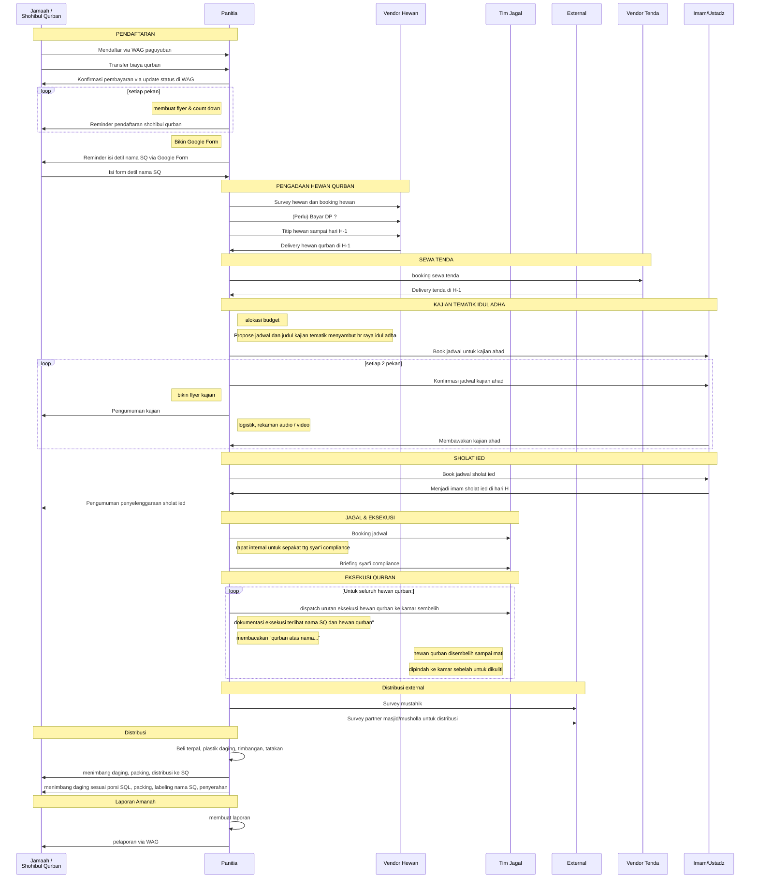

# Qurban

## Timeline

## Pendaftaran
Flow pendaftaran shohibul-qurban

sequenceDiagram
    participant sq as Jamaah / Shohibul Qurban
    participant pa as Panitia
    %%
    note over sq, pa: PENDAFTARAN
    sq->>pa: Mendaftar via WAG paguyuban
    sq->>pa: Transfer biaya qurban
    pa->>sq: Konfirmasi pembayaran via update status di WAG
    loop setiap pekan
      note left of pa: membuat flyer & count down
      pa->>sq: Reminder pendaftaran shohibul qurban
    end
    note left of pa: Bikin Google Form
    pa->>sq: Reminder isi detil nama SQ via Google Form
    sq->>pa: Isi form detil nama SQ

## Peralatan
1. Tenda
2. Sound system
3. Bambu untuk gantungin karkas
4. Balok kayu untuk tatakan sembelih hewan qurban
5. Balok kayu untuk tatakan potong karkas
6. Terpal untuk alas kerja
7. Bambu untuk bikin ruang jagal
8. Terpal bekas untuk bikin ruang jagal

## Plot area kerja eksekusi

Lihat di PPT

## backup

