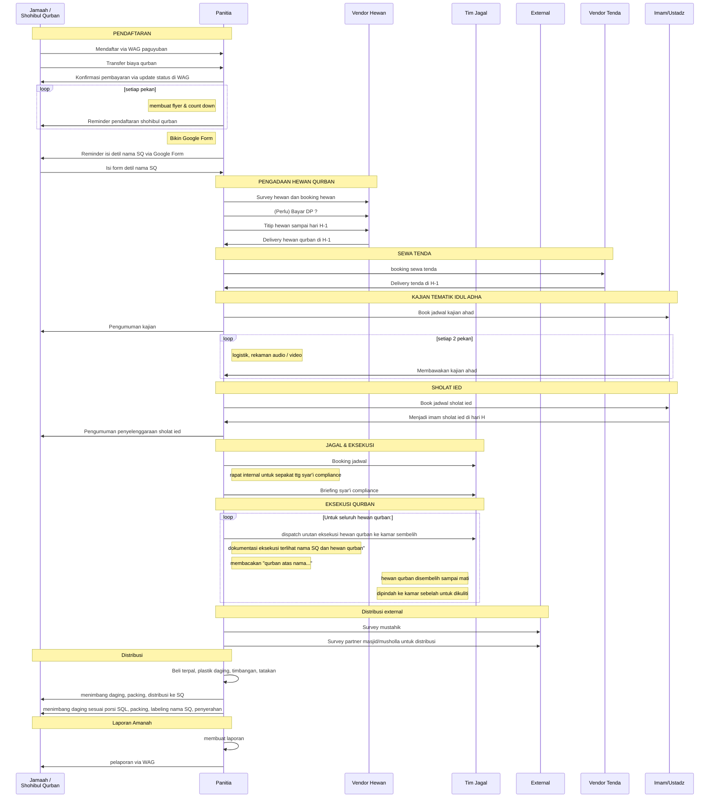
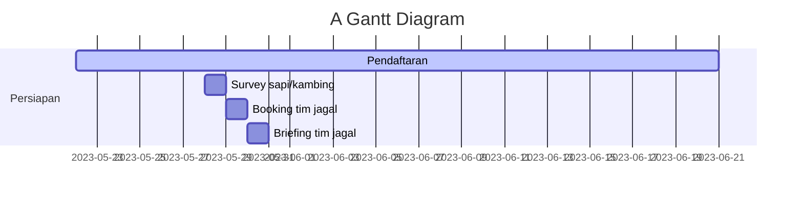

# qurban

## Sequence: pendaftaran

```mermaid
sequenceDiagram
    participant sq as Jamaah /<br>Shohibul Qurban
    participant pa as Panitia
    participant vq as Vendor Hewan
    participant tj as Tim Jagal
    participant ex as External
    participant vt as Vendor Tenda
    participant im as Imam/Ustadz
    
    %%
    note over sq, pa: PENDAFTARAN
    sq->>pa: Mendaftar via WAG paguyuban
    sq->>pa: Transfer biaya qurban
    pa->>sq: Konfirmasi pembayaran via update status di WAG
    loop setiap pekan
      note left of pa: membuat flyer & count down
      pa->>sq: Reminder pendaftaran shohibul qurban
    end
    note left of pa: Bikin Google Form
    pa->>sq: Reminder isi detil nama SQ via Google Form
    sq->>pa: Isi form detil nama SQ

    %%
    note over vq, pa: PENGADAAN HEWAN QURBAN
    pa->>vq: Survey hewan dan booking hewan
    pa->>vq: (Perlu) Bayar DP ?
    pa->>vq: Titip hewan sampai hari H-1
    vq->>pa: Delivery hewan qurban di H-1

    %%
    note over pa, vt: SEWA TENDA
    pa->>vt: booking sewa tenda
    vt->>pa: Delivery tenda di H-1

    %%
    note over pa, im: KAJIAN TEMATIK IDUL ADHA
    pa->>im: Book jadwal kajian ahad
    pa->>sq: Pengumuman kajian
    loop setiap 2 pekan
      note right of pa: logistik, rekaman audio / video
      im->>pa: Membawakan kajian ahad
    end

    %%
    note over pa, im: SHOLAT IED
    pa->>im: Book jadwal sholat ied
    im->>pa: Menjadi imam sholat ied di hari H
    pa->>sq: Pengumuman penyelenggaraan sholat ied

    %%
    note over pa, tj: JAGAL & EKSEKUSI
    pa->>tj: Booking jadwal
    note right of pa: rapat internal untuk sepakat ttg syar'i compliance 
    pa->>tj: Briefing syar'i compliance

    note over pa, tj: EKSEKUSI QURBAN
    loop Untuk seluruh hewan qurban:
      pa->>tj: dispatch urutan eksekusi hewan qurban ke kamar sembelih
      note right of pa: dokumentasi eksekusi terlihat nama SQ dan hewan qurban"
      note right of pa: membacakan "qurban atas nama..."
      note left of tj: hewan qurban disembelih sampai mati
      note left of tj: dipindah ke kamar sebelah untuk dikuliti
    end
    
    %%
    note over pa, ex: Distribusi external
    pa->>ex: Survey mustahik
    pa->>ex: Survey partner masjid/musholla untuk distribusi

    note over sq, pa: Distribusi
    pa->>pa: Beli terpal, plastik daging, timbangan, tatakan
    pa->>sq: menimbang daging, packing, distribusi ke SQ
    pa->>sq: menimbang daging sesuai porsi SQL, packing, labeling nama SQ, penyerahan

    note over sq, pa: Laporan Amanah
    pa->>pa: membuat laporan
    pa->>sq: pelaporan via WAG

```

## Timeline

```mermaid
gantt
    title A Gantt Diagram
    dateFormat  YYYY-MM-DD
    
    section Persiapan
    Pendaftaran: active, 2023-05-22, 30d
    Survey sapi/kambing : 2023-05-28, 1d
    Booking tim jagal      : 2023-05-29, 1d
    Briefing tim jagal     : 2023-05-30, 1d
```
