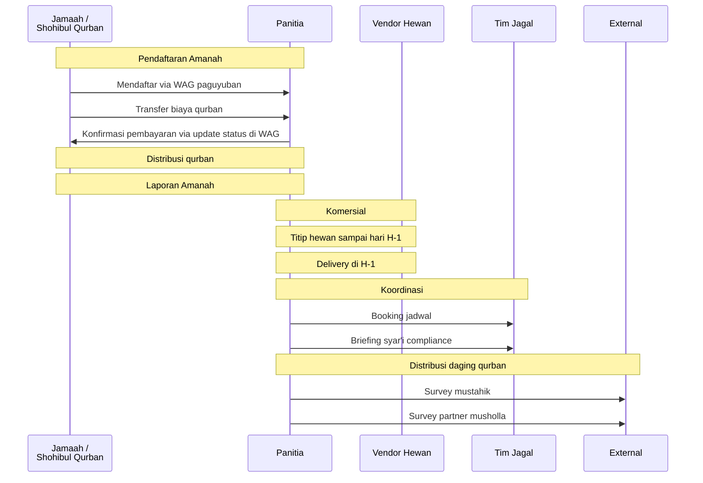
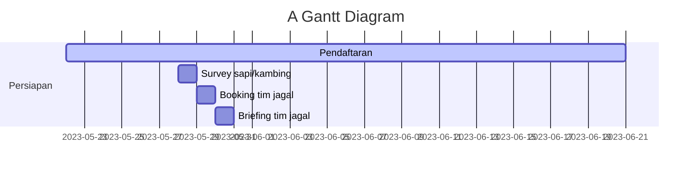

# qurban

## Sequence: pendaftaran

```mermaid
sequenceDiagram
    participant sq as Jamaah /<br>Shohibul Qurban
    participant pa as Panitia
    
    %%
    note over sq,pa: Pendaftaran Amanah
    sq->>pa: Mendaftar via WAG paguyuban
    sq->>pa: Transfer biaya qurban
    pa->>sq: Konfirmasi pembayaran via update status di WAG
    
    note over sq, pa: Distribusi qurban

    note over sq, pa: Laporan Amanah

    %%
    participant vq as Vendor Hewan
    note over vq, pa: Komersial
    note over vq, pa: Titip hewan sampai hari H-1
    note over vq, pa: Delivery di H-1

    %%
    participant tj as Tim Jagal
    note over pa, tj: Koordinasi
    pa->>tj: Booking jadwal
    pa->>tj: Briefing syar'i compliance

    %%
    participant ex as External
    note over pa, ex: Distribusi daging qurban
    pa->>ex: Survey mustahik
    pa->>ex: Survey partner musholla
```

## Timeline

```mermaid
gantt
    title A Gantt Diagram
    dateFormat  YYYY-MM-DD
    
    section Persiapan
    Pendaftaran: active, 2023-05-22, 30d
    Survey sapi/kambing : 2023-05-28, 1d
    Booking tim jagal      : 2023-05-29, 1d
    Briefing tim jagal     : 2023-05-30, 1d
```
